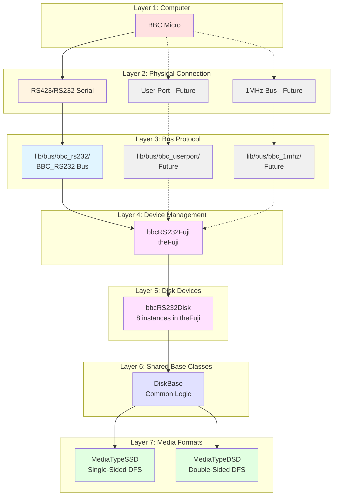
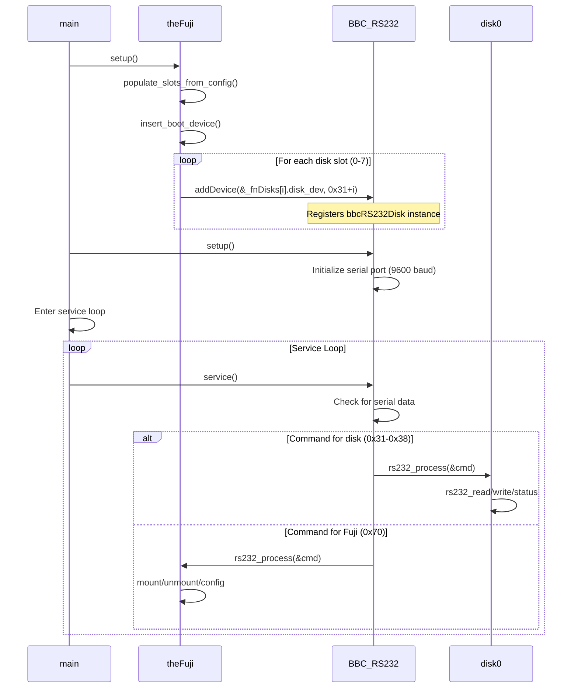
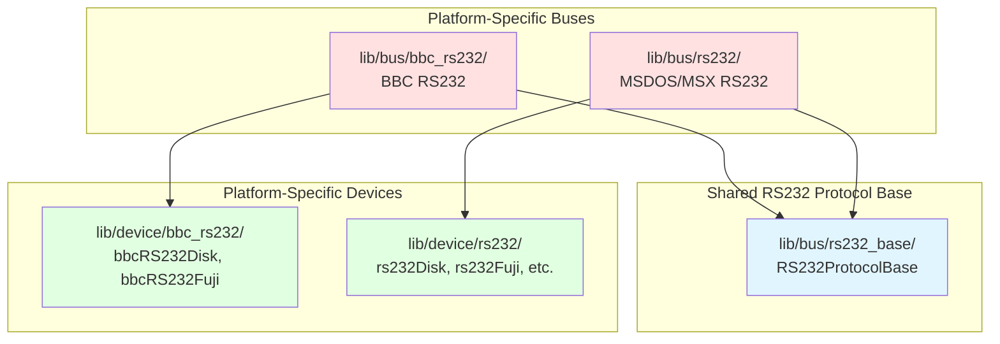

# FujiNet BBC Micro Implementation

## Overview

This document describes the complete implementation of BBC Micro support in FujiNet firmware, including the disk device abstraction layer, multi-bus architecture, and integration with the FujiNet device management system.

## Architecture Summary

The BBC Micro implementation uses a four-layer architecture that enables code reuse across multiple physical connection types (RS232, User Port, 1MHz Bus) while maintaining clean separation of concerns.

### Four-Layer Architecture



## Critical Understanding: Device Instance Management

### The DEVICE_TYPE Macro Pattern

Disk devices in FujiNet are **NOT** created as global instances. Instead, they are managed by the Fuji device through a compile-time macro system:

#### 1. Type Definition ([`lib/device/disk.h`](../../lib/device/disk.h:74))
```cpp
#ifdef BUILD_BBC_RS232
#include "bbc_rs232/disk.h"
#undef DEVICE_TYPE
#define DEVICE_TYPE bbcRS232Disk  // ← Defines disk type for BBC
#endif
```

#### 2. Fuji Disk Structure ([`lib/fuji/fujiDisk.h`](../../lib/fuji/fujiDisk.h))
```cpp
struct fujiDisk {
    DEVICE_TYPE disk_dev;  // Expands to: bbcRS232Disk disk_dev;
    // ... other members (filename, host_slot, etc.)
};
```

#### 3. Fuji Device Class ([`lib/device/fujiDevice.h`](../../lib/device/fujiDevice.h:109))
```cpp
class fujiDevice {
protected:
    fujiDisk _fnDisks[MAX_DISK_DEVICES];  // Array of 8 disk slots
    // Each slot contains a bbcRS232Disk instance!
};
```

#### 4. Global Fuji Instance ([`lib/device/bbc_rs232/bbcFuji.cpp`](../../lib/device/bbc_rs232/bbcFuji.cpp:15))
```cpp
bbcRS232Fuji platformFuji;           // ← Concrete instance
fujiDevice *theFuji = &platformFuji; // ← Global pointer used everywhere
```

### Runtime Initialization Flow



## Build System Integration

### Build Command
```bash
./build.sh -p BBC_RS232
```

### What Happens

1. **build.sh** passes `BBC_RS232` to cmake as `FUJINET_TARGET`
2. **fujinet_pc.cmake** (line 40-46):
   ```cmake
   if(FUJINET_TARGET STREQUAL "BBC_RS232")
       set(FUJINET_BUILD_PLATFORM BUILD_BBC_RS232)
       set(FUJINET_BUILD_BOARD fujinet-pc-bbc-rs232)
       set(FUJINET_BUILD_BUS BBC_RS232)
   endif()
   ```

3. **Compiler flags** (line 106):
   ```cmake
   set(CMAKE_CXX_FLAGS "${CMAKE_CXX_FLAGS} -DBUILD_BBC ...")
   ```

4. **Source files** (line 416-433):
   - BBC RS232 bus
   - BBC media formats (SSD/DSD)
   - BBC RS232 devices (disk, Fuji)

### Important: ESP_PLATFORM is NOT Defined

When building with `-p` parameter:
- ✅ `BUILD_BBC_RS232` is defined
- ❌ `ESP_PLATFORM` is NOT defined
- This is a **PC build** (Linux/Windows/Mac)
- Uses POSIX APIs, not ESP32 APIs

## File Organization

```
fujinet-firmware/
├── lib/
│   ├── bus/
│   │   ├── bus.h                    # Platform selector (modified)
│   │   ├── rs232_base/              # Shared RS232 protocol (new)
│   │   │   ├── rs232_protocol.h     # Base classes & protocol
│   │   │   ├── rs232_protocol.cpp   # Shared implementation
│   │   │   └── README.md            # Usage guide
│   │   └── bbc_rs232/               # BBC RS232 bus (new)
│   │       ├── bbc_rs232.h          # Inherits from rs232_base
│   │       └── bbc_rs232.cpp        # BBC-specific implementation
│   │
│   ├── device/
│   │   ├── disk.h                   # DEVICE_TYPE selector (modified)
│   │   ├── device.h                 # Device includes (modified)
│   │   ├── disk_base.h              # Shared base class (new)
│   │   ├── disk_base.cpp
│   │   └── bbc_rs232/               # BBC RS232 devices (new)
│   │       ├── disk.h               # bbcRS232Disk
│   │       ├── disk.cpp
│   │       ├── bbcFuji.h            # bbcRS232Fuji
│   │       ├── bbcFuji.cpp
│   │       └── README.md
│   │
│   └── media/
│       ├── media_base.h             # Shared base class (new)
│       ├── media_base.cpp
│       └── bbc/                     # BBC formats (new, shared)
│           ├── mediatype_ssd.h
│           ├── mediatype_ssd.cpp
│           ├── mediatype_dsd.h
│           ├── mediatype_dsd.cpp
│           └── README.md
│
├── src/
│   └── main.cpp                     # BUILD_BBC_RS232 block (modified)
│
├── docs/
│   └── arch/
│       ├── disk.md                  # Disk architecture (modified)
│       ├── bbc.md                   # This document (new)
│       └── rs232_refactoring_plan.md # RS232 refactoring plan (new)
│
├── fujinet_pc.cmake                 # BBC_RS232 target (modified)
└── build.sh                         # Supports -p BBC_RS232
```

## Multi-Bus Support

### Current Implementation: RS232/RS423

**Status**: ✅ Fully implemented

**Files**:
- Bus: [`lib/bus/bbc_rs232/`](../../lib/bus/bbc_rs232/)
- Devices: [`lib/device/bbc_rs232/`](../../lib/device/bbc_rs232/)
- Media: [`lib/media/bbc/`](../../lib/media/bbc/) (shared)

**Build**: `./build.sh -p BBC_RS232`

### Future Implementation: User Port

**Status**: 🔜 Planned

**Files** (to be created):
- Bus: `lib/bus/bbc_userport/`
- Devices: `lib/device/bbc_userport/`
- Media: [`lib/media/bbc/`](../../lib/media/bbc/) (reused!)

**Build**: `./build.sh -p BBC_USERPORT`

### Future Implementation: 1MHz Bus

**Status**: 🔜 Planned

**Files** (to be created):
- Bus: `lib/bus/bbc_1mhz/`
- Devices: `lib/device/bbc_1mhz/`
- Media: [`lib/media/bbc/`](../../lib/media/bbc/) (reused!)

**Build**: `./build.sh -p BBC_1MHZ`

### Code Sharing Across Buses

**100% Shared** (write once, use with all buses):
- ✅ [`MediaTypeSSD`](../../lib/media/bbc/mediatype_ssd.h) - Single-sided DFS format
- ✅ [`MediaTypeDSD`](../../lib/media/bbc/mediatype_dsd.h) - Double-sided DFS format
- ✅ [`DiskBase`](../../lib/device/disk_base.h) - Common disk logic
- ✅ [`MediaTypeBase`](../../lib/media/media_base.h) - Common media logic
## RS232 Protocol Sharing (rs232_base)

### Overview

The BBC RS232 implementation uses a shared protocol base layer ([`lib/bus/rs232_base/`](../../lib/bus/rs232_base/)) that eliminates code duplication across all RS232-based platforms (BBC, MSDOS, MSX, etc.).

### Architecture



### What's Shared in rs232_base

**Protocol Functions** (100% reuse):
- ✅ `RS232Protocol::calculate_checksum()` - 8-bit checksum algorithm
- ✅ `RS232Protocol::cmdFrame_t` - Command frame structure
- ✅ `RS232Protocol::processCommand()` - Command routing logic
- ✅ Device management: `addDevice()`, `remDevice()`, `deviceById()`
- ✅ Aux byte helpers: `rs232_get_aux16_lo()`, `rs232_get_aux16_hi()`, `rs232_get_aux32()`

**Base Classes**:
- ✅ `RS232DeviceBase` - Base for all RS232 devices
- ✅ `RS232BusBase` - Base for all RS232 buses

### What's BBC-Specific

**BBC Only Implements**:
- ❌ `readCommandFrame()` - Read from BBC serial port
- ❌ `setup()` - Initialize BBC serial port
- ❌ `service()` - Check for BBC serial data
- ❌ `shutdown()` - Clean up BBC resources
- ❌ Protocol methods: `rs232_ack()`, `rs232_nak()`, `rs232_complete()`, `rs232_error()`

### Benefits

1. **Minimal Code**: BBC bus implementation is only ~180 lines (was 331)
2. **No Duplication**: Checksum, command routing, device management shared
3. **Easy Device Addition**: Just create device class, register it, done!
4. **Automatic NAK**: Unknown devices silently ignored by shared `processCommand()`
5. **Future-Proof**: New RS232 platforms can reuse rs232_base

### Example: Adding a Printer Device

```cpp
// 1. Create device class
// lib/device/bbc_rs232/printer.h
class bbcRS232Printer : public RS232DeviceBase {
    void rs232_process(cmdFrame_t *cmd) override {
        // Handle printer commands
    }
    void rs232_status() override {
        // Return printer status
    }
};

// 2. Register with bus
// lib/device/bbc_rs232/bbcFuji.cpp
bbcRS232Printer thePrinter;
BBC_RS232.addDevice(&thePrinter, 0x40);

// 3. That's it! The bus automatically routes commands to it
```

### Dependency Chain

```
lib/device/bbc_rs232/disk.h
    ↓ inherits from
lib/bus/bbc_rs232/virtualDevice
    ↓ inherits from
lib/bus/rs232_base/RS232DeviceBase
```

**Command Flow**:
1. Serial data arrives at BBC_RS232
2. `readCommandFrame()` reads it (BBC-specific)
3. `processCommand()` verifies checksum (SHARED)
4. `processCommand()` finds device (SHARED)
5. `processCommand()` routes to device (SHARED)
6. Device `rs232_process()` handles command

- ✅ [`RS232ProtocolBase`](../../lib/bus/rs232_base/rs232_protocol.h) - RS232 protocol (for RS232-based buses)

**Bus-Specific** (unique per bus):
- ❌ Serial port initialization
- ❌ Platform-specific timing
- ❌ Hardware-specific I/O

## Supported Disk Formats

### SSD - Single-Sided DFS

**Specifications**:
- File extension: `.ssd`
- Sector size: 256 bytes
- Sectors per track: 10
- Tracks: 40 or 80
- Capacity: 100KB (40 track) or 200KB (80 track)

**Implementation**: [`MediaTypeSSD`](../../lib/media/bbc/mediatype_ssd.h)

### DSD - Double-Sided DFS

**Specifications**:
- File extension: `.dsd`
- Sector size: 256 bytes
- Sectors per track: 10 per side
- Tracks: 40 or 80 per side
- Sides: 2 (interleaved)
- Capacity: 200KB (40 track) or 400KB (80 track)

**Implementation**: [`MediaTypeDSD`](../../lib/media/bbc/mediatype_dsd.h)

### ADFS - Advanced Disc Filing System

**Status**: 🔜 Planned for future implementation

## Device IDs

BBC RS232 uses the following device IDs:

| Device | ID Range | Description |
|--------|----------|-------------|
| Disks | 0x31-0x38 | 8 disk slots (D1-D8) |
| Fuji | 0x70 | Configuration device |
| Printer | 0x40 | Printer device (future) |
| Network | 0x71-0x78 | Network devices (future) |

## Command Protocol

### Disk Commands

| Command | Code | Description |
|---------|------|-------------|
| READ | 0x52 | Read sector from disk |
| WRITE | 0x57 | Write sector to disk |
| STATUS | 0x53 | Get disk status |
| FORMAT | 0x46 | Format disk |

### Fuji Commands

Supports standard FujiNet commands:
- `FUJICMD_MOUNT_IMAGE` - Mount disk image
- `FUJICMD_UNMOUNT_IMAGE` - Unmount disk image
- `FUJICMD_MOUNT_HOST` - Mount network host
- `FUJICMD_OPEN_DIRECTORY` - Browse directories
- `FUJICMD_NEW_DISK` - Create blank disk
- And more... (see [`bbcFuji.cpp`](../../lib/device/bbc_rs232/bbcFuji.cpp:179))

## How It Works

### Compile-Time Setup

```cpp
// 1. Build with BBC_RS232 target
./build.sh -p BBC_RS232

// 2. CMake defines BUILD_BBC_RS232
-DBUILD_BBC

// 3. disk.h defines DEVICE_TYPE
#ifdef BUILD_BBC_RS232
#define DEVICE_TYPE bbcRS232Disk
#endif

// 4. fujiDisk contains bbcRS232Disk
struct fujiDisk {
    DEVICE_TYPE disk_dev;  // = bbcRS232Disk
};

// 5. fujiDevice contains 8 fujiDisk slots
class fujiDevice {
    fujiDisk _fnDisks[8];  // 8 bbcRS232Disk instances
};

// 6. Global instance created
bbcRS232Fuji platformFuji;
fujiDevice *theFuji = &platformFuji;
```

### Runtime Initialization

```cpp
// main.cpp - BUILD_BBC_RS232 block
#ifdef BUILD_BBC_RS232
    theFuji->setup();              // Initialize Fuji device
        ↓
    bbcRS232Fuji::setup()
        ↓
    populate_slots_from_config()   // Load disk config
        ↓
    for (i = 0; i < 8; i++)
        BBC_RS232.addDevice(&_fnDisks[i].disk_dev, 0x31 + i);
        // Adds 8 bbcRS232Disk instances to bus
    
    BBC_RS232.setup();             // Initialize RS232 bus (9600 baud)
#endif
```

### Service Loop (Using rs232_base)

```cpp
// fn_service_loop()
while (not shutting down) {
    SYSTEM_BUS.service();  // Expands to: BBC_RS232.service()
        ↓
    BBC_RS232.service()  // BBC-specific
        ↓
    if (serial data available) {
        readCommandFrame(&cmd)  // BBC-specific: read from serial port
            ↓
        processCommand(&cmd)  // SHARED: from RS232BusBase
            ↓
        RS232BusBase::processCommand()  // SHARED implementation
            - Verify checksum (SHARED)
            - Find device by ID (SHARED)
            - Route to device (SHARED)
            ↓
        if (device_id == 0x70) {
            theFuji->rs232_process(&cmd)  // Fuji commands
        }
        else if (device_id >= 0x31 && device_id <= 0x38) {
            _fnDisks[device_id - 0x31].disk_dev.rs232_process(&cmd)
                ↓
            bbcRS232Disk::rs232_process()
                ↓
            switch (command) {
                READ → rs232_read() → read_sector() → MediaTypeSSD::read()
                WRITE → rs232_write() → write_sector() → MediaTypeSSD::write()
                STATUS → rs232_status() → get_status()
            }
        }
        else {
            // Unknown device - silently ignored by processCommand()
        }
    }
}
```

## Data Flow Example: Reading a Sector

```
1. BBC Micro sends:
   Device: 0x31 (Disk 1)
   Command: 0x52 (READ)
   Aux: sector number
   Checksum

2. BBC_RS232.service() receives command
   ↓
3. Finds device 0x31 in daisy chain
   = theFuji->_fnDisks[0].disk_dev (bbcRS232Disk instance)
   ↓
4. Calls: disk_dev.rs232_process(&cmd)
   ↓
5. bbcRS232Disk::rs232_process()
   - Sends ACK
   - Calls rs232_read()
   ↓
6. bbcRS232Disk::rs232_read()
   - Gets sector number from cmdFrame
   - Calls read_sector(sector_num, buffer, &count)
   ↓
7. DiskBase::read_sector()
   - Calls _media->read(sector_num, &count)
   ↓
8. MediaTypeSSD::read()
   - Calculates file offset
   - Seeks to position
   - Reads 256 bytes into _sector_buffer
   ↓
9. bbcRS232Disk::rs232_read()
   - Calls bus_to_computer(buffer, 256, false)
   ↓
10. BBC_RS232 sends:
    - 256 bytes of data
    - Checksum
    - COMPLETE ('C')
```

## Multiple Inheritance Pattern

The BBC implementation uses **multiple inheritance** to combine functionality:

```cpp
class bbcRS232Disk : public DiskBase,      // Disk logic
                     public virtualDevice  // RS232 protocol
{
    // From DiskBase:
    bool read_sector(...) override;
    bool write_sector(...) override;
    MediaTypeBase* create_media_type(...) override;
    
    // From virtualDevice (RS232 bus):
    void rs232_process(cmdFrame_t *cmd) override;
    void rs232_status() override;
    
    // RS232-specific:
    void rs232_read();
    void rs232_write(bool verify);
};

class bbcRS232Fuji : public fujiDevice,    // Fuji logic
                     public virtualDevice  // RS232 protocol
{
    // From fujiDevice:
    void setup() override;
    fujiDisk _fnDisks[8];  // Contains 8 bbcRS232Disk
    
    // From virtualDevice (RS232 bus):
    void rs232_process(cmdFrame_t *cmd) override;
    void rs232_status() override;
};
```

## Code Reuse Statistics

### Shared Across ALL Platforms Using RS232
- RS232 protocol base: ~220 lines (checksum, command routing, device management)
- Used by: BBC RS232, MSDOS RS232, MSX RS232, future RS232 platforms

### Shared Across ALL BBC Buses
- Media layer: 1,183 lines (SSD + DSD)
- DiskBase: 407 lines
- MediaTypeBase: 403 lines
- **Total shared: 1,993 lines**

### BBC RS232 Specific
- Bus implementation: ~180 lines (was 331, now 45% smaller!)
- Device implementation: ~787 lines (disk + Fuji)
- **Total BBC RS232: ~967 lines**

### Efficiency
- **Before refactoring**: BBC had 331 lines of bus code (80% duplicated from lib/bus/rs232)
- **After refactoring**: BBC has 180 lines + 220 shared = 400 lines total
- **Savings**: 45% reduction in BBC bus code, eliminates duplication

## Testing

### Build Test
```bash
cd fujinet-firmware
./build.sh -p BBC_RS232
# Should compile without errors
# Output: build/dist/fujinet
```

### Runtime Test
```bash
cd build/dist
./fujinet
# Should initialize BBC_RS232 bus
# Should add theFuji and 8 disk devices
# Should enter service loop
```

### Hardware Test (with BBC Micro)
1. Connect BBC Micro to FujiNet via RS423
2. Configure BBC serial: `*FX 7,4` (9600 baud)
3. Run fujinet executable
4. Mount BBC disk image via Fuji commands
5. Test disk I/O from BBC BASIC

## Implementation Files

### Core Files (25 total)

**RS232 Protocol Base** (3 files, 509 lines) - **NEW**:
- [`rs232_protocol.h`](../../lib/bus/rs232_base/rs232_protocol.h) - Base classes and protocol
- [`rs232_protocol.cpp`](../../lib/bus/rs232_base/rs232_protocol.cpp) - Shared implementation
- [`README.md`](../../lib/bus/rs232_base/README.md) - Usage guide

**Disk/Media Base Classes** (4 files, 810 lines):
- [`disk_base.h`](../../lib/device/disk_base.h), [`disk_base.cpp`](../../lib/device/disk_base.cpp)
- [`media_base.h`](../../lib/media/media_base.h), [`media_base.cpp`](../../lib/media/media_base.cpp)

**BBC Media** (5 files, 1,310 lines):
- [`mediatype_ssd.h`](../../lib/media/bbc/mediatype_ssd.h), [`mediatype_ssd.cpp`](../../lib/media/bbc/mediatype_ssd.cpp)
- [`mediatype_dsd.h`](../../lib/media/bbc/mediatype_dsd.h), [`mediatype_dsd.cpp`](../../lib/media/bbc/mediatype_dsd.cpp)
- [`README.md`](../../lib/media/bbc/README.md)

**BBC RS232 Bus** (2 files, ~180 lines) - **Refactored**:
- [`bbc_rs232.h`](../../lib/bus/bbc_rs232/bbc_rs232.h) - Inherits from rs232_base
- [`bbc_rs232.cpp`](../../lib/bus/bbc_rs232/bbc_rs232.cpp) - Minimal BBC-specific code

**BBC RS232 Devices** (5 files, 1,184 lines):
- [`disk.h`](../../lib/device/bbc_rs232/disk.h), [`disk.cpp`](../../lib/device/bbc_rs232/disk.cpp)
- [`bbcFuji.h`](../../lib/device/bbc_rs232/bbcFuji.h), [`bbcFuji.cpp`](../../lib/device/bbc_rs232/bbcFuji.cpp)
- [`README.md`](../../lib/device/bbc_rs232/README.md)

**Integration** (6 files modified):
- [`bus.h`](../../lib/bus/bus.h), [`disk.h`](../../lib/device/disk.h), [`device.h`](../../lib/device/device.h)
- [`main.cpp`](../../src/main.cpp), [`fujinet_pc.cmake`](../../fujinet_pc.cmake)
- [`docs/arch/disk.md`](../../docs/arch/disk.md)

## Future Enhancements

### Short Term
- [ ] Test with real BBC Micro hardware
- [ ] Implement printer device
- [ ] Implement network device
- [ ] Add modem support

### Medium Term
- [ ] User Port bus implementation
- [ ] 1MHz Bus implementation
- [ ] ADFS format support
- [ ] High-speed mode (19200+ baud)

### Long Term
- [ ] Disk caching for performance
- [ ] Async I/O operations
- [ ] Copy protection handling
- [ ] Bad sector emulation

## References

- [BBC Micro RS423](http://beebwiki.mdfs.net/RS423)
- [BBC DFS Format](http://beebwiki.mdfs.net/Acorn_DFS_disc_format)
- [FujiNet Disk Architecture](disk.md)
- [FujiNet Project](https://fujinet.online/)

## Contributing

When adding features to BBC support:

1. **For all buses**: Add to [`lib/media/bbc/`](../../lib/media/bbc/) or [`DiskBase`](../../lib/device/disk_base.h)
2. **For RS232 only**: Add to [`lib/device/bbc_rs232/`](../../lib/device/bbc_rs232/) or [`lib/bus/bbc_rs232/`](../../lib/bus/bbc_rs232/)
3. **For new bus**: Create new `lib/bus/bbc_XXX/` and `lib/device/bbc_XXX/` directories
4. Test with real hardware
5. Update documentation

## License

Same as FujiNet firmware project.