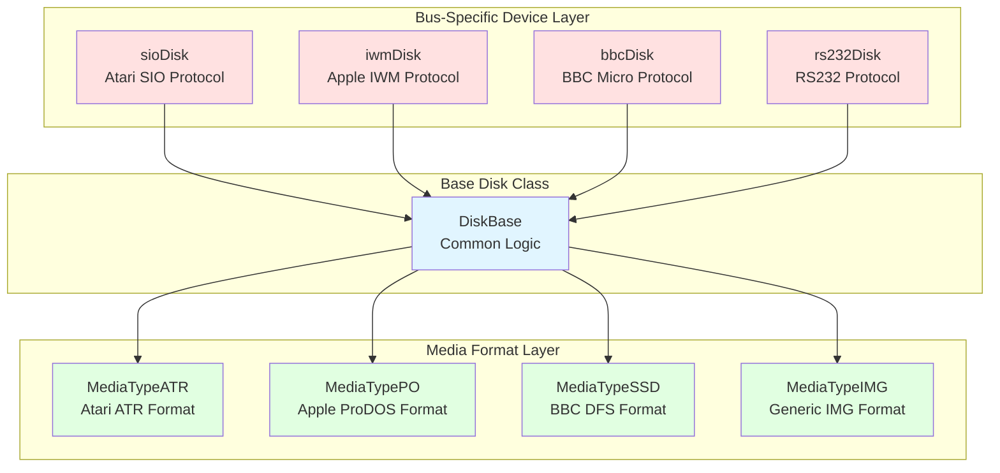
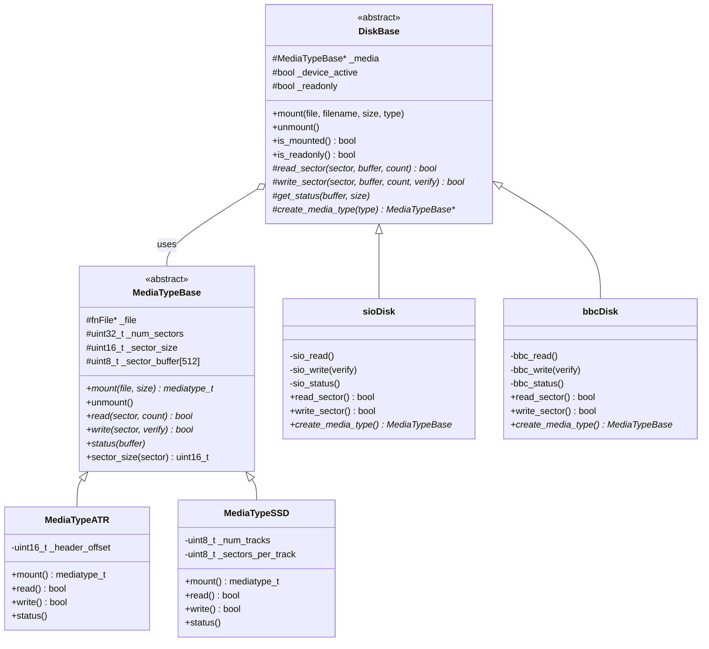
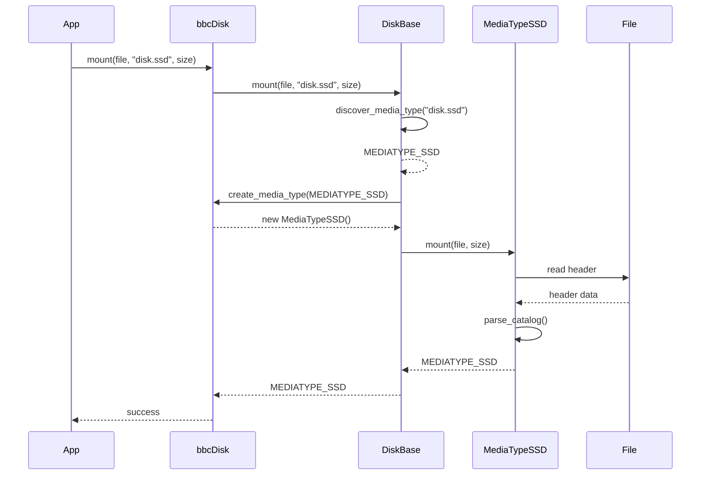
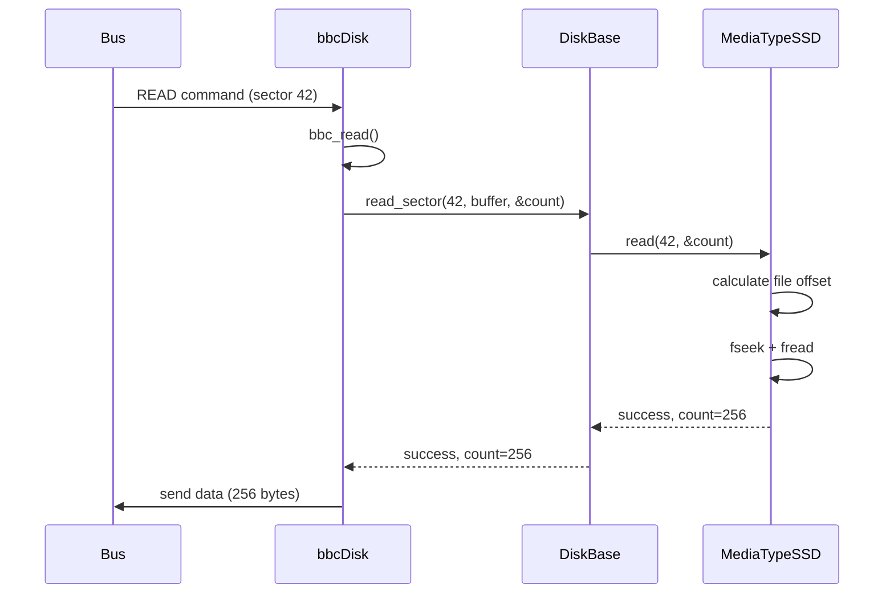
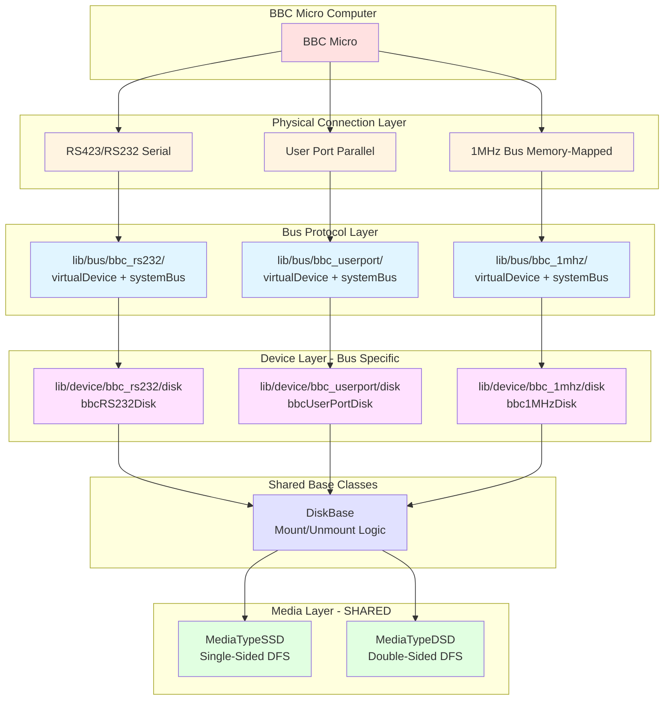

# FujiNet Disk Device Architecture

## Overview

This document describes the high-level architecture for disk device implementations in FujiNet firmware. The design provides a clean abstraction layer that separates bus-specific protocol handling from media format management, enabling code reuse across multiple platforms while maintaining flexibility for platform-specific optimizations.

## Current State Analysis

### Problems with Existing Implementation

1. **Code Duplication**: Each platform (SIO, IWM, RS232, etc.) has its own complete disk implementation with approximately 80% duplicated code
2. **Tight Coupling**: Bus protocol logic is mixed with media format handling
3. **Inconsistent Interfaces**: Different platforms use different method signatures for similar operations
4. **No Clear Abstraction**: MediaType classes are platform-specific despite handling similar disk formats

### Common Patterns

All disk implementations share these core responsibilities:
- **Mount/Unmount**: Managing disk image files
- **Read/Write**: Sector/block I/O operations
- **Status**: Reporting disk state and geometry
- **Format**: Creating new disk images
- **Media Management**: Delegating to MediaType subclasses for format-specific operations

## Proposed Architecture

### Three-Layer Design



### Layer Responsibilities

#### 1. Bus-Specific Device Layer
**Location**: `lib/device/{platform}/disk.{h,cpp}`

**Responsibilities**:
- Handle platform-specific protocol commands
- Manage bus communication (ACK/NAK, checksums, timing)
- Translate bus commands to generic operations
- Report platform-specific status codes

**Examples**: [`sioDisk`](../../lib/device/sio/disk.h), [`iwmDisk`](../../lib/device/iwm/disk.h), [`bbcDisk`](../../lib/device/bbc/disk.h)

#### 2. Base Disk Class
**Location**: `lib/device/disk_base.{h,cpp}`

**Responsibilities**:
- Common mount/unmount logic
- MediaType lifecycle management
- Shared utility methods
- Define pure virtual interface for subclasses

**Key Methods**:
- `mount()` - Mount disk image with auto-detection
- `unmount()` - Clean unmount of disk image
- `read_sector()` - Pure virtual, implemented by subclasses
- `write_sector()` - Pure virtual, implemented by subclasses
- `create_media_type()` - Factory method for platform-specific media types

#### 3. Media Format Layer
**Location**: `lib/media/{platform}/mediatype_{format}.{h,cpp}`

**Responsibilities**:
- Format-specific I/O operations
- Sector/block translation and addressing
- Image file parsing and validation
- Format-specific status reporting

**Examples**: [`MediaTypeATR`](../../lib/media/atari/diskTypeAtr.h), [`MediaTypePO`](../../lib/media/apple/mediaTypePO.h), [`MediaTypeSSD`](../../lib/media/bbc/mediatype_ssd.h)

## Class Hierarchy



## Key Design Decisions

### 1. Pure Virtual Methods for I/O

The base class defines pure virtual methods for [`read_sector()`](../../lib/device/disk_base.h) and [`write_sector()`](../../lib/device/disk_base.h) because:
- Each bus has different timing requirements
- Protocol-specific error handling varies
- Allows maximum flexibility for platform-specific optimizations
- Forces subclasses to implement critical operations

### 2. Factory Pattern for Media Types

The [`create_media_type()`](../../lib/device/disk_base.h) factory method allows:
- Platform-specific MediaType instantiation
- Clean separation of concerns
- Easy addition of new formats
- Type-safe media type creation

### 3. Unified Media Type Enumeration

Using a single enum with platform-specific ranges:
```cpp
enum mediatype_t {
    MEDIATYPE_UNKNOWN = 0,
    
    // Atari types (0x0100-0x01FF)
    MEDIATYPE_ATR = 0x0100,
    MEDIATYPE_ATX = 0x0101,
    
    // Apple types (0x0200-0x02FF)
    MEDIATYPE_DO = 0x0200,
    MEDIATYPE_PO = 0x0201,
    
    // BBC types (0x0300-0x03FF)
    MEDIATYPE_SSD = 0x0300,
    MEDIATYPE_DSD = 0x0301,
    
    // Generic types (0xFF00-0xFFFF)
    MEDIATYPE_IMG = 0xFF00
};
```

Benefits:
- Simplifies type checking across platforms
- Allows cross-platform media type detection
- Maintains backward compatibility
- Clear namespace separation

### 4. Sector Buffer Management

MediaType owns the sector buffer because:
- Reduces memory allocation overhead
- Simplifies buffer lifecycle management
- Allows format-specific buffer optimizations
- Prevents buffer ownership conflicts

## Data Flow

### Mount Operation



### Read Operation



## Benefits

1. **Code Reuse**: Approximately 60% reduction in duplicated code
2. **Maintainability**: Single place to fix common bugs
3. **Extensibility**: Easy to add new platforms and formats
4. **Testability**: Base classes can be unit tested independently
5. **Clarity**: Clear separation between protocol and format handling
6. **Type Safety**: Strong typing prevents mixing incompatible types

## Implementation Strategy

### Phase 1: Create Base Classes
1. Implement [`DiskBase`](../../lib/device/disk_base.h) with common mount/unmount logic
2. Implement [`MediaTypeBase`](../../lib/media/media_base.h) with shared utilities
3. Add comprehensive documentation and examples

### Phase 2: BBC Implementation (Reference Implementation)
1. Create directory structure:
   - `lib/device/bbc/`
   - `lib/media/bbc/`
2. Implement [`bbcDisk`](../../lib/device/bbc/disk.h) class
3. Implement [`MediaTypeSSD`](../../lib/media/bbc/mediatype_ssd.h) class (Single-sided DFS)
4. Implement [`MediaTypeDSD`](../../lib/media/bbc/mediatype_dsd.h) class (Double-sided DFS)
5. Add BBC-specific bus integration

### Phase 3: Testing & Validation
1. Create unit tests for base classes
2. Test BBC implementation with real disk images
3. Verify read/write operations
4. Test mount/unmount cycles

### Phase 4: Migration Path (Future)
1. Document migration guide for existing implementations
2. Create adapter classes for backward compatibility
3. Gradually migrate existing platforms to new base classes

## BBC Micro Disk Specifications

### DFS (Disk Filing System)

#### Single-Sided (SSD)
- **Sector Size**: 256 bytes
- **Sectors per Track**: 10
- **Tracks**: 40 or 80
- **Total Capacity**: 100KB (40 track) or 200KB (80 track)
- **File Extension**: `.ssd`

#### Double-Sided (DSD)
- **Sector Size**: 256 bytes
- **Sectors per Track**: 10 per side
- **Tracks**: 40 or 80 per side
- **Sides**: 2
- **Total Capacity**: 200KB (40 track) or 400KB (80 track)
- **File Extension**: `.dsd`

#### Catalog Structure
- Located in sectors 0-1 of track 0
- Contains disk title and file entries
- Each file entry: 8 bytes filename + metadata

## File Organization

```
fujinet-firmware/
├── lib/
│   ├── device/
│   │   ├── disk_base.h          # Base disk device class
│   │   ├── disk_base.cpp        # Implementation
│   │   ├── disk.h               # Platform selector (existing)
│   │   ├── sio/
│   │   │   ├── disk.h           # Atari SIO disk (to be migrated)
│   │   │   └── disk.cpp
│   │   ├── iwm/
│   │   │   ├── disk.h           # Apple IWM disk (to be migrated)
│   │   │   └── disk.cpp
│   │   └── bbc/
│   │       ├── disk.h           # BBC disk device (new)
│   │       └── disk.cpp
│   └── media/
│       ├── media_base.h         # Base media type class
│       ├── media_base.cpp       # Implementation
│       ├── media.h              # Platform selector (existing)
│       ├── atari/
│       │   ├── diskType.h       # Atari media types (to be migrated)
│       │   ├── diskTypeAtr.h
│       │   └── ...
│       ├── apple/
│       │   ├── mediaType.h      # Apple media types (to be migrated)
│       │   ├── mediaTypePO.h
│       │   └── ...
│       └── bbc/
│           ├── mediatype_ssd.h  # BBC SSD format (new)
│           ├── mediatype_ssd.cpp
│           ├── mediatype_dsd.h  # BBC DSD format (new)
│           └── mediatype_dsd.cpp
└── docs/
    └── arch/
        └── disk.md              # This document
```

## Migration Example

### Before (Current Implementation)
```cpp
// Platform-specific, duplicated code
class rs232Disk : public virtualDevice {
    MediaType *_disk;
    
    void rs232_read() {
        // Protocol handling + I/O mixed together
        if (_disk == nullptr) {
            rs232_error();
            return;
        }
        uint32_t readcount;
        bool err = _disk->read(cmdFrame.aux, &readcount);
        bus_to_computer(_disk->_disk_sectorbuff, readcount, err);
    }
    
    mediatype_t mount(...) {
        // Format detection + mounting mixed
        if (_disk != nullptr) {
            delete _disk;
            _disk = nullptr;
        }
        disk_type = MediaType::discover_mediatype(filename);
        switch (disk_type) {
            case MEDIATYPE_IMG:
                _disk = new MediaTypeImg();
                return _disk->mount(f, disksize);
        }
    }
};
```

### After (New Design)
```cpp
// Clean separation of concerns
class rs232Disk : public DiskBase {
protected:
    // Only protocol-specific logic
    bool read_sector(uint32_t sector_num, uint8_t *buffer, 
                     uint16_t *count) override {
        // RS232-specific protocol handling only
        return _media->read(sector_num, count);
    }
    
    // Factory for RS232-compatible media types
    MediaTypeBase* create_media_type(mediatype_t disk_type) override {
        switch (disk_type) {
            case MEDIATYPE_IMG:
                return new MediaTypeImg();
            default:
                return nullptr;
        }
    }
};

// Common mounting logic in DiskBase (shared by all platforms)
```

## Future Enhancements

1. **Async I/O**: Add support for asynchronous read/write operations
2. **Caching**: Implement sector caching for improved performance
3. **Compression**: Support for compressed disk images
4. **Network Images**: Enhanced support for network-mounted images
5. **Hot Swap**: Support for disk swapping without unmount
6. **Multi-format**: Support for multi-format disk images

## References

- [Atari SIO Protocol](https://www.atarimax.com/jindroush.atari.org/asio.html)
- [Apple IWM Protocol](https://www.apple2.org.za/gswv/a2zine/faqs/Csa2KFAQ.html)
- [BBC Micro DFS](http://beebwiki.mdfs.net/Acorn_DFS_disc_format)
- [FujiNet Project](https://fujinet.online/)

## Glossary

- **DiskBase**: Abstract base class for all disk device implementations
- **MediaTypeBase**: Abstract base class for all disk format implementations
- **Bus**: Communication protocol between computer and FujiNet (SIO, IWM, etc.)
- **Sector**: Fixed-size block of data on disk (typically 128, 256, or 512 bytes)
- **Mount**: Process of opening and validating a disk image file
- **DFS**: Disk Filing System (BBC Micro's disk format)
- **SSD**: Single-Sided Disk image format

## Multi-Bus Support for BBC Micro

### Overview

The BBC Micro can connect to FujiNet through multiple physical interfaces:
- **RS232/RS423**: Serial connection (primary, to be implemented first)
- **User Port**: Parallel user port interface (future)
- **1MHz Bus**: Memory-mapped expansion bus (future)

Each bus requires its own protocol implementation but can share the same disk and media logic.

### Four-Layer Architecture for BBC



### How Multiple Buses Work

#### Pattern: Bus-Specific Device Classes

Following the existing FujiNet pattern, each bus defines its own `virtualDevice` base class:

**Atari SIO Bus**:
```cpp
// lib/bus/sio/sio.h
class virtualDevice {
    virtual void sio_process(uint32_t commanddata, uint8_t checksum) = 0;
    virtual void sio_status() = 0;
    void sio_ack();
    void sio_nak();
};
```

**RS232 Bus**:
```cpp
// lib/bus/rs232/rs232.h
class virtualDevice {
    virtual void rs232_process(cmdFrame_t *cmd) = 0;
    virtual void rs232_status() = 0;
    void rs232_ack();
    void rs232_nak();
};
```

**BBC RS232 Bus** (to be created):
```cpp
// lib/bus/bbc_rs232/bbc_rs232.h
class virtualDevice {
    virtual void rs232_process(cmdFrame_t *cmd) = 0;
    virtual void rs232_status() = 0;
    void rs232_ack();
    void rs232_nak();
    // BBC-specific RS423 protocol methods
};
```

#### Multiple Inheritance Solution

Each bus-specific disk device uses **multiple inheritance**:

```cpp
// lib/device/bbc_rs232/disk.h
class bbcRS232Disk : public DiskBase,           // Disk logic
                     public virtualDevice       // RS232 bus protocol
{
protected:
    // Implement DiskBase pure virtuals
    bool read_sector(...) override;
    bool write_sector(...) override;
    MediaTypeBase* create_media_type(...) override;
    
    // Implement virtualDevice pure virtuals (RS232)
    void rs232_process(cmdFrame_t *cmd) override;
    void rs232_status() override;
};
```

```cpp
// lib/device/bbc_userport/disk.h
class bbcUserPortDisk : public DiskBase,        // SAME disk logic
                        public virtualDevice    // UserPort bus protocol
{
protected:
    // Implement DiskBase pure virtuals (SAME implementation)
    bool read_sector(...) override;
    bool write_sector(...) override;
    MediaTypeBase* create_media_type(...) override;  // SAME!
    
    // Implement virtualDevice pure virtuals (UserPort)
    void userport_process(cmdFrame_t *cmd) override;
    void userport_status() override;
};
```

### Code Sharing Across Buses

#### What's Shared (100% reuse)

✅ **Media Layer**: [`MediaTypeSSD`](../../lib/media/bbc/mediatype_ssd.h), [`MediaTypeDSD`](../../lib/media/bbc/mediatype_dsd.h)
- Same SSD/DSD format regardless of bus
- Read/write sector logic identical
- Catalog parsing identical

✅ **DiskBase**: [`lib/device/disk_base.h`](../../lib/device/disk_base.h)
- Mount/unmount logic
- Media lifecycle management
- Type discovery

✅ **Factory Method**: `create_media_type()` implementation
```cpp
// IDENTICAL in all BBC disk devices
MediaTypeBase* create_media_type(mediatype_t disk_type) {
    switch (disk_type) {
        case MEDIATYPE_SSD: return new MediaTypeSSD();
        case MEDIATYPE_DSD: return new MediaTypeDSD();
        default: return nullptr;
    }
}
```

#### What's Bus-Specific (unique per bus)

❌ **Bus Protocol**: Each bus has different:
- Timing requirements
- Handshaking (ACK/NAK vs ready/busy)
- Command format
- Data transfer method

❌ **Command Processing**: Different buses have different command sets

### Example: Read Operation Across Three Buses

#### RS232 Bus
```cpp
void bbcRS232Disk::rs232_read() {
    // 1. RS232-specific: ACK the command
    rs232_ack();
    
    // 2. SHARED: Read via DiskBase/MediaType
    uint16_t count;
    bool err = read_sector(sector_num, buffer, &count);
    
    // 3. RS232-specific: Send data with RS232 protocol
    bus_to_computer(buffer, count, err);
}
```

#### User Port Bus
```cpp
void bbcUserPortDisk::userport_read() {
    // 1. UserPort-specific: Signal ready
    userport_ready();
    
    // 2. SHARED: Read via DiskBase/MediaType (SAME CODE!)
    uint16_t count;
    bool err = read_sector(sector_num, buffer, &count);
    
    // 3. UserPort-specific: Send data via parallel port
    userport_send_data(buffer, count, err);
}
```

#### 1MHz Bus
```cpp
void bbc1MHzDisk::mhz_read() {
    // 1. 1MHz-specific: Memory-mapped handshake
    mhz_signal_ready();
    
    // 2. SHARED: Read via DiskBase/MediaType (SAME CODE!)
    uint16_t count;
    bool err = read_sector(sector_num, buffer, &count);
    
    // 3. 1MHz-specific: Write to memory-mapped registers
    mhz_write_registers(buffer, count, err);
}
```

### Directory Structure for Multi-Bus BBC

```
fujinet-firmware/
├── lib/
│   ├── bus/
│   │   ├── bbc_rs232/           # RS232/RS423 bus (PHASE 1)
│   │   │   ├── bbc_rs232.h      # virtualDevice + systemBus
│   │   │   └── bbc_rs232.cpp
│   │   ├── bbc_userport/        # User Port bus (PHASE 2)
│   │   │   ├── bbc_userport.h
│   │   │   └── bbc_userport.cpp
│   │   └── bbc_1mhz/            # 1MHz bus (PHASE 3)
│   │       ├── bbc_1mhz.h
│   │       └── bbc_1mhz.cpp
│   │
│   ├── device/
│   │   ├── disk_base.h          # SHARED base class
│   │   ├── disk_base.cpp
│   │   ├── bbc_rs232/           # RS232-specific devices
│   │   │   ├── disk.h           # bbcRS232Disk
│   │   │   ├── disk.cpp
│   │   │   └── README.md
│   │   ├── bbc_userport/        # UserPort-specific devices
│   │   │   ├── disk.h           # bbcUserPortDisk
│   │   │   └── disk.cpp
│   │   └── bbc_1mhz/            # 1MHz-specific devices
│   │       ├── disk.h           # bbc1MHzDisk
│   │       └── disk.cpp
│   │
│   └── media/
│       └── bbc/                 # SHARED across ALL BBC buses
│           ├── mediatype_ssd.h  # Used by all BBC disk devices
│           ├── mediatype_ssd.cpp
│           ├── mediatype_dsd.h
│           ├── mediatype_dsd.cpp
│           └── README.md
```

### Build Configuration for Multiple Buses

```cmake
# RS232/RS423 build
if(FUJINET_TARGET STREQUAL "BBC_RS232")
    set(FUJINET_BUILD_PLATFORM BUILD_BBC_RS232)
    set(FUJINET_BUILD_BUS BBC_RS232)
    list(APPEND SOURCES
        lib/bus/bbc_rs232/bbc_rs232.h
        lib/bus/bbc_rs232/bbc_rs232.cpp
        lib/device/bbc_rs232/disk.h
        lib/device/bbc_rs232/disk.cpp
        # Shared media files
        lib/media/bbc/mediatype_ssd.h
        lib/media/bbc/mediatype_ssd.cpp
        lib/media/bbc/mediatype_dsd.h
        lib/media/bbc/mediatype_dsd.cpp
    )
endif()

# User Port build
if(FUJINET_TARGET STREQUAL "BBC_USERPORT")
    set(FUJINET_BUILD_PLATFORM BUILD_BBC_RS232)
    set(FUJINET_BUILD_BUS BBC_USERPORT)
    list(APPEND SOURCES
        lib/bus/bbc_userport/bbc_userport.h
        lib/bus/bbc_userport/bbc_userport.cpp
        lib/device/bbc_userport/disk.h
        lib/device/bbc_userport/disk.cpp
        # SAME shared media files!
        lib/media/bbc/mediatype_ssd.h
        lib/media/bbc/mediatype_ssd.cpp
        lib/media/bbc/mediatype_dsd.h
        lib/media/bbc/mediatype_dsd.cpp
    )
endif()
```

### Benefits of Multi-Bus Architecture

1. **Media Layer Reuse**: Write SSD/DSD format code once, use with all buses
2. **DiskBase Reuse**: Mount/unmount logic shared across all buses
3. **Independent Bus Development**: Each bus can be developed separately
4. **Easy Testing**: Can test media layer independently of bus
5. **Flexible Deployment**: Users can choose their preferred connection method

### Implementation Priority

**Phase 1: RS232/RS423** (Start Here)
- Most common connection method
- Can reuse existing RS232 bus knowledge
- Provides foundation for other buses

**Phase 2: User Port** (Future)
- Parallel interface for faster transfers
- Reuses all media and disk logic
- Only bus protocol is new

**Phase 3: 1MHz Bus** (Future)
- Memory-mapped interface
- Highest performance option
- Reuses all media and disk logic
- Only bus protocol is new

### Migration Note

The current [`lib/device/bbc/disk.h`](../../lib/device/bbc/disk.h) should be considered a **template**. For actual implementation:

1. **Rename**: `lib/device/bbc/` → `lib/device/bbc_rs232/`
2. **Update class**: `bbcDisk` → `bbcRS232Disk`
3. **Add inheritance**: Inherit from RS232's `virtualDevice`
4. **Implement protocol**: Add RS232-specific methods

The media layer ([`lib/media/bbc/`](../../lib/media/bbc/)) remains unchanged and is shared across all buses.

- **DSD**: Double-Sided Disk image format