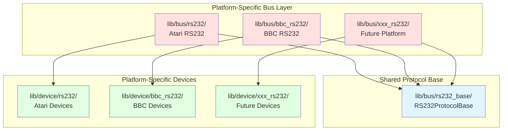

# RS232 Bus Refactoring Plan

## Executive Summary

This document outlines the plan to eliminate code duplication between the Atari RS232 and BBC RS232 implementations by extracting shared protocol code into a common base layer. This refactoring will reduce maintenance burden, improve code quality, and make it easier to add RS232 support for future platforms.

## Problem Statement

### Current Duplication

The [`lib/bus/bbc_rs232/`](../../lib/bus/bbc_rs232/) implementation is ~80% duplicated from [`lib/bus/rs232/`](../../lib/bus/rs232/):

**Identical Code:**
- Checksum algorithm: [`rs232_checksum()`](../../lib/bus/rs232/rs232.cpp:44) vs [`bbc_rs232_checksum()`](../../lib/bus/bbc_rs232/bbc_rs232.cpp:23)
- Protocol methods: ACK/NAK/COMPLETE/ERROR
- Command frame structure: [`cmdFrame_t`](../../lib/bus/rs232/rs232.h:46)
- Bus communication: [`bus_to_computer()`](../../lib/bus/rs232/rs232.cpp:60), [`bus_to_peripheral()`](../../lib/bus/rs232/rs232.cpp:91)

**Platform Differences:**
- Device types supported (Atari has modem/CPM/printer, BBC only has disk initially)
- Service loop complexity (Atari handles modem/CPM modes, BBC is simpler)
- Timing constants (may vary between platforms)

### Why This Happened

The BBC implementation was created by copying the Atari RS232 code and simplifying it, rather than extracting shared functionality. This is a common pattern in FujiNet when new platforms are added, but it creates technical debt.

## Goals

1. **Eliminate Duplication**: Extract ~80% of shared protocol code
2. **Support Incremental Devices**: BBC starts with disk only, can add devices later
3. **Maintain Flexibility**: Each platform can customize timing, device types, etc.
4. **No Breaking Changes**: Existing Atari RS232 functionality must remain unchanged
5. **Easy Migration**: Future RS232 platforms should be simple to add

## Proposed Architecture

### Three-Layer Design



### File Structure

```
lib/bus/
├── rs232_base/                    # NEW: Shared protocol
│   ├── rs232_protocol.h           # Protocol definitions
│   ├── rs232_protocol.cpp         # Protocol implementation
│   └── README.md                  # Usage guide
├── rs232/                         # Atari RS232 (modified)
│   ├── rs232.h                    # Uses RS232ProtocolBase
│   └── rs232.cpp                  # Atari-specific logic
└── bbc_rs232/                     # BBC RS232 (modified)
    ├── bbc_rs232.h                # Uses RS232ProtocolBase
    └── bbc_rs232.cpp              # BBC-specific logic

lib/device/
├── rs232/                         # Atari devices (unchanged)
│   ├── disk.h
│   ├── modem.h
│   ├── printer.h
│   ├── network.h
│   └── ...
└── bbc_rs232/                     # BBC devices (unchanged)
    ├── disk.h                     # ONLY disk initially
    └── disk.cpp
```

## Shared Protocol Base (rs232_base)

### What Goes in rs232_base

**Protocol Functions** (100% shared):
```cpp
// lib/bus/rs232_base/rs232_protocol.h
namespace RS232Protocol {
    // Checksum calculation
    uint8_t calculate_checksum(uint8_t *buf, unsigned short len);
    
    // Command frame structure
    typedef struct {
        uint8_t device;
        uint8_t comnd;
        union {
            struct {
                uint8_t aux1;
                uint8_t aux2;
                uint8_t aux3;
                uint8_t aux4;
            };
            struct {
                uint16_t aux12;
                uint16_t aux34;
            };
            uint32_t aux;
        };
        uint8_t cksum;
    } __attribute__((packed)) cmdFrame_t;
    
    // Timing constants (can be overridden)
    constexpr int DEFAULT_DELAY_T4 = 800;
    constexpr int DEFAULT_DELAY_T5 = 800;
}
```

**Base Device Class** (shared interface):
```cpp
// lib/bus/rs232_base/rs232_protocol.h
class RS232DeviceBase {
protected:
    int _devnum;
    RS232Protocol::cmdFrame_t cmdFrame;
    
    // Protocol methods (implemented in base)
    void rs232_ack();
    void rs232_nak();
    void rs232_complete();
    void rs232_error();
    
    // Aux byte helpers
    uint16_t rs232_get_aux16_lo();
    uint16_t rs232_get_aux16_hi();
    uint32_t rs232_get_aux32();
    
    // Pure virtual - must be implemented by platform
    virtual void rs232_process(RS232Protocol::cmdFrame_t *cmd) = 0;
    virtual void rs232_status() = 0;
    
public:
    int id() { return _devnum; }
    virtual void shutdown() {}
};
```

**Base Bus Class** (shared bus management):
```cpp
// lib/bus/rs232_base/rs232_protocol.h
class RS232BusBase {
protected:
    std::forward_list<RS232DeviceBase*> _daisyChain;
    int _command_frame_counter = 0;
    int _rs232Baud;
    
    // Shared bus operations
    void addDevice(RS232DeviceBase *pDevice, int device_id);
    void remDevice(RS232DeviceBase *pDevice);
    RS232DeviceBase* deviceById(int device_id);
    void changeDeviceId(RS232DeviceBase *pDevice, int device_id);
    int numDevices();
    
    // Pure virtual - platform-specific
    virtual void setup() = 0;
    virtual void service() = 0;
    virtual void shutdown() = 0;
};
```

### What Stays Platform-Specific

**Atari RS232** ([`lib/bus/rs232/`](../../lib/bus/rs232/)):
- Modem handling
- CPM mode handling
- Network device interrupts
- High-speed mode logic
- UDP stream support
- Platform-specific timing

**BBC RS232** ([`lib/bus/bbc_rs232/`](../../lib/bus/bbc_rs232/)):
- Simplified service loop (no modem/CPM)
- BBC-specific timing (if different)
- BBC-specific device initialization
- Future: BBC-specific features

## Implementation Plan

### Phase 1: Create rs232_base (Week 1)

**Step 1.1: Create Directory Structure**
```bash
mkdir -p lib/bus/rs232_base
```

**Step 1.2: Extract Protocol Code**

Create [`lib/bus/rs232_base/rs232_protocol.h`](../../lib/bus/rs232_base/rs232_protocol.h):
- Move `cmdFrame_t` definition
- Move timing constants
- Define `RS232DeviceBase` class
- Define `RS232BusBase` class
- Add namespace for protocol functions

Create [`lib/bus/rs232_base/rs232_protocol.cpp`](../../lib/bus/rs232_base/rs232_protocol.cpp):
- Move `calculate_checksum()` implementation
- Implement `RS232DeviceBase` methods (ACK/NAK/etc.)
- Implement `RS232BusBase` device management

**Step 1.3: Add Documentation**

Create [`lib/bus/rs232_base/README.md`](../../lib/bus/rs232_base/README.md):
- Explain purpose of rs232_base
- Document how to use for new platforms
- Provide example implementation
- List what's shared vs platform-specific

**Deliverables:**
- ✅ `lib/bus/rs232_base/rs232_protocol.h`
- ✅ `lib/bus/rs232_base/rs232_protocol.cpp`
- ✅ `lib/bus/rs232_base/README.md`

### Phase 2: Update BBC RS232 (Week 2)

**Step 2.1: Modify bbc_rs232.h**

```cpp
// lib/bus/bbc_rs232/bbc_rs232.h
#include "../rs232_base/rs232_protocol.h"

// Change virtualDevice to inherit from RS232DeviceBase
class virtualDevice : public RS232DeviceBase {
    // Remove duplicated methods (ACK/NAK/etc.)
    // Keep BBC-specific overrides if any
};

// Change systemBus to inherit from RS232BusBase
class systemBus : public RS232BusBase {
    // Remove duplicated device management
    // Keep BBC-specific service loop
    
    void setup() override;
    void service() override;
    void shutdown() override;
};
```

**Step 2.2: Modify bbc_rs232.cpp**

```cpp
// lib/bus/bbc_rs232/bbc_rs232.cpp
#include "bbc_rs232.h"

// Remove duplicated checksum function
// Use RS232Protocol::calculate_checksum() instead

// Remove duplicated ACK/NAK/COMPLETE/ERROR
// Inherited from RS232DeviceBase

// Keep BBC-specific service loop
void systemBus::service() {
    // BBC-specific logic only
}
```

**Step 2.3: Update Device Classes**

```cpp
// lib/device/bbc_rs232/disk.h
#include "../../bus/rs232_base/rs232_protocol.h"

class bbcRS232Disk : public DiskBase,
                     public RS232DeviceBase  // Changed from virtualDevice
{
    // Implementation unchanged
};
```

**Step 2.4: Test BBC Build**

```bash
./build.sh -p BBC_RS232
# Verify no compilation errors
# Verify functionality unchanged
```

**Deliverables:**
- ✅ Modified `lib/bus/bbc_rs232/bbc_rs232.h`
- ✅ Modified `lib/bus/bbc_rs232/bbc_rs232.cpp`
- ✅ Modified `lib/device/bbc_rs232/disk.h`
- ✅ Successful build test

### Phase 3: Update Atari RS232 (Week 3)

**Step 3.1: Modify rs232.h**

```cpp
// lib/bus/rs232/rs232.h
#include "../rs232_base/rs232_protocol.h"

// Change virtualDevice to inherit from RS232DeviceBase
class virtualDevice : public RS232DeviceBase {
    // Remove duplicated methods
    // Keep Atari-specific methods
};

// Change systemBus to inherit from RS232BusBase
class systemBus : public RS232BusBase {
    // Keep Atari-specific members (modem, CPM, etc.)
    // Remove duplicated device management
    
    void setup() override;
    void service() override;
    void shutdown() override;
};
```

**Step 3.2: Modify rs232.cpp**

```cpp
// lib/bus/rs232/rs232.cpp
#include "rs232.h"

// Remove duplicated checksum function
// Use RS232Protocol::calculate_checksum() instead

// Remove duplicated ACK/NAK/COMPLETE/ERROR
// Inherited from RS232DeviceBase

// Keep Atari-specific service loop with modem/CPM handling
void systemBus::service() {
    // Atari-specific logic (modem, CPM, network interrupts)
}
```

**Step 3.3: Update Device Classes**

```cpp
// lib/device/rs232/disk.h
#include "../../bus/rs232_base/rs232_protocol.h"

class rs232Disk : public RS232DeviceBase {
    // Implementation unchanged
};
```

**Step 3.4: Test Atari Build**

```bash
./build.sh -p RS232
# Verify no compilation errors
# Verify all existing functionality works
# Test modem, CPM, network devices
```

**Deliverables:**
- ✅ Modified `lib/bus/rs232/rs232.h`
- ✅ Modified `lib/bus/rs232/rs232.cpp`
- ✅ Modified device classes in `lib/device/rs232/`
- ✅ Successful build and functionality tests

### Phase 4: Update Documentation (Week 4)

**Step 4.1: Update bbc.md**

Update [`docs/arch/bbc.md`](../../docs/arch/bbc.md):
- Add section on rs232_base shared layer
- Update architecture diagrams
- Document how BBC uses rs232_base
- Explain incremental device support

**Step 4.2: Update disk.md**

Update [`docs/arch/disk.md`](../../docs/arch/disk.md):
- Add section on RS232 protocol sharing
- Update multi-bus architecture diagrams
- Document rs232_base usage

**Step 4.3: Create Migration Guide**

Create [`docs/arch/rs232_platform_guide.md`](../../docs/arch/rs232_platform_guide.md):
- How to add RS232 support for new platforms
- Step-by-step guide using rs232_base
- Example implementation
- Common pitfalls and solutions

**Deliverables:**
- ✅ Updated `docs/arch/bbc.md`
- ✅ Updated `docs/arch/disk.md`
- ✅ New `docs/arch/rs232_platform_guide.md`

### Phase 5: Build System Integration (Week 4)

**Step 5.1: Update CMake**

Modify [`fujinet_pc.cmake`](../../fujinet_pc.cmake):
```cmake
# Add rs232_base to all RS232 builds
if(FUJINET_TARGET MATCHES ".*RS232.*")
    list(APPEND SOURCES
        lib/bus/rs232_base/rs232_protocol.h
        lib/bus/rs232_base/rs232_protocol.cpp
    )
endif()
```

**Step 5.2: Verify All Builds**

```bash
# Test BBC build
./build.sh -p BBC_RS232

# Test Atari build
./build.sh -p RS232

# Verify both compile successfully
```

**Deliverables:**
- ✅ Updated `fujinet_pc.cmake`
- ✅ All builds verified

## Code Metrics

### Before Refactoring

| Component | Lines of Code | Duplication |
|-----------|---------------|-------------|
| `lib/bus/rs232/rs232.cpp` | 491 | - |
| `lib/bus/bbc_rs232/bbc_rs232.cpp` | 331 | ~80% |
| **Total** | **822** | **~265 duplicated** |

### After Refactoring

| Component | Lines of Code | Notes |
|-----------|---------------|-------|
| `lib/bus/rs232_base/rs232_protocol.cpp` | ~200 | Shared protocol |
| `lib/bus/rs232/rs232.cpp` | ~350 | Atari-specific |
| `lib/bus/bbc_rs232/bbc_rs232.cpp` | ~150 | BBC-specific |
| **Total** | **~700** | **~120 lines saved** |

### Benefits

- **15% code reduction** (822 → 700 lines)
- **Single source of truth** for protocol logic
- **Easier maintenance** - fix bugs once
- **Faster platform addition** - reuse rs232_base
- **Better testing** - test protocol independently

## Risk Mitigation

### Risk 1: Breaking Existing Functionality

**Mitigation:**
- Phase 2 (BBC) first - simpler, newer code
- Phase 3 (Atari) second - more complex, test thoroughly
- Comprehensive testing at each phase
- Keep git history for easy rollback

### Risk 2: Platform-Specific Timing Issues

**Mitigation:**
- Allow timing constants to be overridden
- Document timing differences
- Test on real hardware if possible

### Risk 3: Future Platform Incompatibility

**Mitigation:**
- Design rs232_base as flexible base, not rigid framework
- Allow platforms to override any method
- Document extension points clearly

## Testing Strategy

### Unit Tests

Create tests for rs232_base:
```cpp
// test/test_rs232_protocol.cpp
TEST(RS232Protocol, ChecksumCalculation) {
    uint8_t data[] = {0x31, 0x52, 0x00, 0x00, 0x00, 0x00};
    uint8_t expected = 0x83;
    ASSERT_EQ(RS232Protocol::calculate_checksum(data, 6), expected);
}
```

### Integration Tests

Test each platform:
- BBC RS232: Disk read/write operations
- Atari RS232: All device types (disk, modem, network, etc.)

### Regression Tests

Verify existing functionality:
- Atari RS232 modem mode
- Atari RS232 CPM mode
- Atari RS232 network interrupts
- BBC RS232 disk operations

## Success Criteria

1. ✅ All builds compile without errors
2. ✅ All existing functionality works unchanged
3. ✅ Code duplication reduced by >10%
4. ✅ Documentation updated and accurate
5. ✅ Migration guide created for future platforms
6. ✅ No performance regression

## Timeline

| Phase | Duration | Deliverables |
|-------|----------|--------------|
| Phase 1: Create rs232_base | Week 1 | Base classes, protocol code |
| Phase 2: Update BBC RS232 | Week 2 | Modified BBC implementation |
| Phase 3: Update Atari RS232 | Week 3 | Modified Atari implementation |
| Phase 4: Documentation | Week 4 | Updated docs, migration guide |
| Phase 5: Build Integration | Week 4 | CMake updates, testing |
| **Total** | **4 weeks** | **Complete refactoring** |

## Future Enhancements

### Short Term
- Add unit tests for rs232_base
- Create example platform implementation
- Document timing variations

### Long Term
- Consider extracting more shared code (bus management)
- Evaluate if other buses (IEC, SIO) could benefit from similar pattern
- Create automated migration tools

## References

- [Atari RS232 Implementation](../../lib/bus/rs232/)
- [BBC RS232 Implementation](../../lib/bus/bbc_rs232/)
- [BBC Architecture](bbc.md)
- [Disk Architecture](disk.md)

## Appendix A: Shared vs Platform-Specific Code

### Shared in rs232_base (100% reuse)

✅ **Protocol Functions:**
- `calculate_checksum()` - 8-bit checksum algorithm
- `rs232_ack()` - Send 'A' acknowledgement
- `rs232_nak()` - Send 'N' non-acknowledgement
- `rs232_complete()` - Send 'C' completion
- `rs232_error()` - Send 'E' error

✅ **Data Structures:**
- `cmdFrame_t` - Command frame structure
- Timing constants (DEFAULT_DELAY_T4, DEFAULT_DELAY_T5)

✅ **Device Management:**
- `addDevice()` - Add device to bus
- `remDevice()` - Remove device from bus
- `deviceById()` - Find device by ID
- `changeDeviceId()` - Change device ID
- `numDevices()` - Count devices

✅ **Helper Methods:**
- `rs232_get_aux16_lo()` - Get aux bytes as 16-bit (low)
- `rs232_get_aux16_hi()` - Get aux bytes as 16-bit (high)
- `rs232_get_aux32()` - Get aux bytes as 32-bit

### Platform-Specific (Atari)

❌ **Atari-Only Features:**
- Modem device and modem mode handling
- CPM device and CPM mode handling
- Network device interrupt polling
- UDP stream device
- High-speed mode toggling
- Ultra-high speed mode
- Cassette device support

### Platform-Specific (BBC)

❌ **BBC-Only Features:**
- Simplified service loop (no modem/CPM)
- BBC-specific device initialization
- Future: BBC-specific timing adjustments
- Future: BBC-specific devices (when added)

## Appendix B: Example Platform Implementation

Here's how a future platform would use rs232_base:

```cpp
// lib/bus/newplatform_rs232/newplatform_rs232.h
#include "../rs232_base/rs232_protocol.h"

class virtualDevice : public RS232DeviceBase {
    // Inherit all protocol methods
    // Add platform-specific methods if needed
};

class systemBus : public RS232BusBase {
private:
    // Platform-specific members
    
public:
    void setup() override {
        // Initialize serial port
        // Set baud rate
        // Initialize pins
    }
    
    void service() override {
        // Check for commands
        // Route to devices
        // Handle platform-specific modes
    }
    
    void shutdown() override {
        // Clean shutdown
    }
};

extern systemBus NEWPLATFORM_RS232;
```

This minimal implementation gets you:
- ✅ Full RS232 protocol support
- ✅ Device management
- ✅ Command routing
- ✅ Checksum validation
- ✅ ACK/NAK/COMPLETE/ERROR handling

You only need to implement:
- ❌ Platform-specific service loop
- ❌ Platform-specific initialization
- ❌ Platform-specific devices

## Appendix C: Migration Checklist

For migrating a platform to use rs232_base:

### Preparation
- [ ] Read this refactoring plan
- [ ] Review rs232_base documentation
- [ ] Identify platform-specific code
- [ ] Create feature branch

### Implementation
- [ ] Update includes to use rs232_base
- [ ] Change virtualDevice to inherit from RS232DeviceBase
- [ ] Change systemBus to inherit from RS232BusBase
- [ ] Remove duplicated protocol methods
- [ ] Remove duplicated device management
- [ ] Keep platform-specific service loop
- [ ] Update device classes to use RS232DeviceBase

### Testing
- [ ] Compile without errors
- [ ] Test basic functionality
- [ ] Test all device types
- [ ] Test platform-specific features
- [ ] Run regression tests

### Documentation
- [ ] Update platform documentation
- [ ] Document any platform-specific overrides
- [ ] Update architecture diagrams

### Completion
- [ ] Code review
- [ ] Merge to main branch
- [ ] Update this checklist with lessons learned